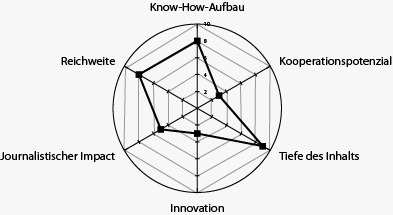

# Abschlussarbeit-CAS-Datenjournalismus
Mein Repository zur CAS-Abschlussarbeit

## Fertige Arbeit
Link zur Online-Arbeit, aufbereitet für Abgabetermin am 17. Februar: 

Die Arbeit erscheint als Listicle aufbereitet ab dem 18. Februar im neuen Website-Layout und nach dem Mobile-First-Konzept in der Berner Zeitung. Ebenso in der Printversion mit eigenem Layout.

## Idee

#### Die Aktualität
Im März 2020 stimmt der Grosse Rat des Kantons Bern in zweiter Lesung über ein neues Steuergesetz ab. Vorgesehen sind Erleichterungen für Firmen (im Zusammenhang mit der STAF) und für Familien (höhere Abzüge bei Kinderdrittbetreuung). Steuersenkungen sollen später in den Budgets linear auf Stufe der Anlage (nicht bei den Tarifen im Gesetz) gemacht werden. 

#### Die angedachte Datengeschichte
Ich möchte im Vorfeld dieser Abstimmung aufzeigen, wie sich die Steuerzahler und die Steuererträge im Kanton Bern seit 2005 entwickelt haben. Als Grundlage dienen mir vorerst folgende Statistiken:
https://www.sv.fin.be.ch/sv_fin/de/index/navi/index/organisation/statistik/statistik_einkommennp.html  (natürliche Personen)

https://www.sv.fin.be.ch/sv_fin/de/index/navi/index/organisation/statistik/statistik_Steuerstatistik_gewinnkapital_jp.html (juristische Personen)

#### Meine Thesen nach einer Durchsicht
1. Es heisst immer, der Kanton Bern sei unattraktiv für Firmen. Dennoch ist ihre Anzahl stark gestiegen in den letzten Jahren, und sie bezahlen auch immer mehr Steuern. 
2. Ich gehe aber davon aus, dass in anderen Kantonen (mein Vergleich wären wohl Zürich sowie Solothurn und/oder Luzern als Nachbarkantone) die Anzahl Firmen und Steuereinnahmen zugenommen haben. 
3. Zudem gehe ich davon aus, dass prozentual gesehen die Firmen im Vergleich zu den Privatpersonen immer einen geringeren Anteil der Steuerlast tragen. 

Fazit: Der Kanton Bern ist zwar attraktiv für Firmen, aber es stellt sich auch die Frage, was für Firmen der Kanton Bern denn anzieht. Wahrscheinlich sind es nicht jene mit den grossen Gewinnen.

4. Bei den natürlichen Personen zeigt sich, dass die Alleinstehenden in den letzten 15 Jahren viel zahlreicher geworden sind, während die Verheirateten stagnierten. Das zeigt sich auch beim Wachstum der Steuererträge: Bei den Alleinstehenden wuchs es stark, bei den Ehepaaren stagniert es. Da stellt sich die Frage, ob der Kanton Bern mit den Abzügen für Kinderdrittbetreuung (von denen zudem vor allem gut Verdienende profitieren werden) am richtigen Ort Anreize setzt. Knackpunkt: Eventuell sind bei den Alleinstehenden auch Konkubinatspaare dabei.

#### Zeitplan
Mein Plan  ist, die Geschichte vor der Debatte im Grossen Rat zu publizieren. Eventuell macht es für unsere Zeitung Sinn, wenn dies erst nach dem 17. Februar der Fall ist, da die Debatte erst im März stattfindet. Ich möchte die Geschichte aber möglichst dann fertig haben, weil ich kurz darauf bis kurz vor unserem Abschlusstermin verreise. Ich würde sie dann halt  als Text oder PDF in mein Repository stellen.

## Vorarbeiten

### Vorgespräch

#### Hans Frauchiger, Leiter Steuerung und Controlling der Berner Steuerverwaltung 
###### Zu den Alleinstehenden: 
- Bei den Alleinstehenden sind tatsächlich auch Konkubinatspaare als zwei Einzelpersonen in der Statistik erfasst. Er liefert mir Zahlen für die Alleinstehenden, also für jene, die den Abzug für Alleinstehende machen dürfen. 
- Unschärfe darin: Auch WGs und Altersheime sind drin. Das ist laut Frauchiger aber vernachlässigbar, es wäre dennoch ein Effekt erkennbar. 
- Achtung: Die Zahlen, die er mir liefert, können leicht differieren zu jenen im Netz, weil mittlerweile mehr Leute definitiv veranlagt sind aus diesen Jahren. Er geht davon aus, dass vor allem die Konkubinatspaare mehr geworden sind. 

###### Zu den Firmen:
- Es gibt vor einigen Jahren einen Ansprung in der Statistik. Grund: Vereine, welche eine gewisse  Gewinnhöhe nicht überschritten, mussten bis dahin keine Steuererklärung ausfüllen. 
- Die Höhe der Gewinne hat sich nicht gross geändert, auch nicht bei grossen. Der Kanton Bern hat im Vergleich zu anderen Kantonen weniger viele jur Personen, die hohe Gewinne haben. Das führt zu einem gewissen Klumpenrisiko. 
- Der Zuwachs hat nicht bei den entscheidenden (aka gewinnstarken) Firmen stattgefunden. 
- Firmen mit Sonderstatut bezahlen nur beim Bund Steuern neu (STAF)

###### Vergleichbarkeit andere Kantone:
- Zürich scheint ihm am vergleichbarsten zu sein von der Struktur her. Eventuell auch noch Fribourg. 

###### Knackpunkte aus seiner Sicht: 
- Die Steuerverwaltung soll effizienter arbeiten, hat aber immer mehr zu tun, mehr zu veranlagen (überall ein Problem, demographische Entwicklung). 
- Klumpenrisiko bei den Firmen (wenn eine grosse geht, hat der Kanton ein Problem)
- Durch viele Abzüge etcetera lässt die Steuerstatistik fast keine Rückschlüsse auf die wirkliche finanzielle Situation der Steuerzahler zu (bsp Kinderdrittbetreuung, Pendlerkosten, Berufskosten, Alleinstehendenabzug, usw.). Eine Analyse wird immer schwieriger, und man kann sich sehr schnell verlieren. 

###### Allgemein zu sonst noch vorhandenen Statistiken (damit ich keine Arbeit mache, die es schon fixfertig irgendwo gibt): 
- Das Bundesamt für Statistik führt Bevölkerungsstatistiken, bringt sie aber nicht mit dem Steuerertrag in Zusammenhang (nach dem Gespräch überprüft, fokussiert sich auch ausschliesslich auf die direkten Bundessteuern)
- Die Eidgenössische Steuerverwaltung zieht interkantonale Vergleiche (nach dem Gespräch überprüft; beisst sich nicht mit meinem Projekt. Evtl. später zur Einbettung wieder hinzuziehen)
- Viel geforscht wird zu Familienformen; dort sind dann auch Transferleistungen wie Sozialhilfe etcetera mit dabei. 
- Für den Schweizerischen Nationalfonds wäre das Thema wohl zu lokal.
- Leider kann er mir nichts Vergleichbares zu den Jahren ab 2018 liefern, weil der Veranlagungsstand noch zu wenig repräsentativ ist.

(Geplant war auch ein Vorgespräch mit Matthias Stürmer. Er reagierte aber nicht auf mehrmaliges Nachfragen, sondern meldete sich erst, als alle Codes geschrieben waren. Da mir Hans Frauchiger sehr fundiert Auskunft geben konnte, habe ich auf weiteres Insistieren verzichtet.)

### Spider

Know-How-Aufbau: 8
Kooperationspotenzial: 3
Tiefe des Inhalts: 9
Innovation: 3
Journalistischer Impact: 5
Reichweite: 8

## Datensätze und Codes

Die Datensätze und Codes finden sich in diesem Repository. Direktverweise:

Codes/Plots zu Einkommenssteuern:
https://github.com/sandrarutschi/Abschlussarbeit-CAS-Datenjournalismus/blob/master/Reinschrift%20Einkommenssteuer%20richtig.ipynb

Codes/Plots zu Gewinnsteuern:
https://github.com/sandrarutschi/Abschlussarbeit-CAS-Datenjournalismus/blob/master/Gewinnsteuer%20Zusammenf%C3%BCgen%20von%20Jahren.ipynb

https://github.com/sandrarutschi/Abschlussarbeit-CAS-Datenjournalismus/blob/master/Gewinnsteuer%20Plots.ipynb

## Entscheide im Verlauf der Arbeit
- Wirklich vergleichbare Zahlen aus anderen Kantonen sind schwierig zu erhalten. Auch aus Zeitgründen entschliesse ich mich, lediglich im Text eine kurze Einbettung zu machen, wo der Kanton Bern grundsätzlich steht. Denn insgesamt sind bereits die Ergebnisse aus dem Kanton spannend und relevant. Es geht darum, aus diesen Erkenntnissen eine Auswahl zu treffen.
- Ich entscheide mich für die Listicle-Form: 10 Punkte, wie sich der Berner Steuerzahler verändert hat. Plus je eine Grafik zum jeweiligen Aspekt.

## Arbeitsprotokoll

- Idee entwickeln, Vorgespräch Hans Frauchiger, Datensätze sdurchforsten/hochladen, Spider: 6h (verteilt Dez19/Jan20)

- Gewinnsteuer-Statistiken (PDFs) erfassen und aufbereiten: 10h (20./21. Januar 2020)

- Einkommenssteuer-Statistik erfassen und aufbereiten: 3h (22. Januar 2020)

- Plotten: 16h (22.-26. Januar 2020)

- Codes, Plots und Geschichte besprechen mit Kollege: 1h (29. Januar 2020)

- Geschichte schreiben / umsetzen / Plots besprechen und Anpassen mit Grafiker / Gegenlesen im Team: 6 Stunden (verteilt 30. Januar - 12. Februar)

- Feedback / Gegencheck von Hans Frauchiger, Steuerverwaltung (mit Detail-Inputs und Erklärungen): 1h (10.-12. Februar)

## Nächste Schritte
- Geschichte erfassen und gestalten im CS für Online und Printversion
- Letzte Gegenlese im Team
- Publikation
